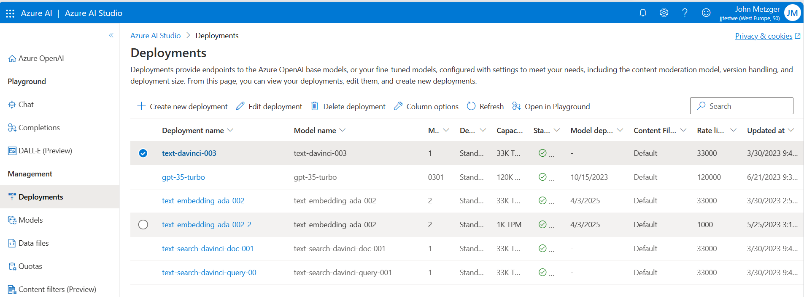

# Azure OpenAI Chat Samples using REST calls
Azure OpenAI has the ability to assist in a number of AI/cognitive services, so it is important to understand how this works.

There are a number of samples and SDKs, but I often prefer getting down to the *bare metal* of HTTP REST calls. This repo shows how to do a few use cases directly as REST requests. These are:
1. Completions
2. Basic chat
3. Chat with embeddings - that is, over your own data.

I personally use the [REST client](https://marketplace.visualstudio.com/items?itemName=humao.rest-client)  in Visual Studio code as this can use parameters and chain requests. Check it out.

## Prerequisites
In order to do any of these demos, you need to have deployed an Azure OpenAI service into your Azure subscription. This service is being rationed and so you may need to apply for it.

In addition, you also need to deploy some models into that instance. Note that the region you choose for OpenAI is important as not all models are available in all regions. I personally use *West Europe* as this at the time of writing has good model availability. The models needed will depend on the uses cases below.



## Completions
This is a really simple use case where you send a piece of test and it will attempt to "complete" what you started. A nice simple service.

```
### some variables
@deployment = your_openai_name
@api-key = XXXXXXXXXXXXXXXXXX
@model = text-davinci-003

### call OpenAI REST interface - completions
POST https://{{deployment}}.openai.azure.com/openai/deployments/{{model}}/completions?api-version=2023-05-15
api-key: {{api-key}}
Content-Type: application/json

{
  "prompt": "Once upon a time",
  "max_tokens": 5
}
```

This will return different values each run, but here's one I prepared earlier.
```
HTTP/1.1 200 OK
Cache-Control: no-cache, must-revalidate
Content-Length: 276
Content-Type: application/json
Access-Control-Allow-Origin: *
apim-request-id: 5da2ae7a-3398-4a62-b505-2e8ab0e78dc8
Strict-Transport-Security: max-age=31536000; includeSubDomains; preload
x-ms-region: West Europe
x-content-type-options: nosniff
Openai-Model: text-davinci-003
Openai-Processing-Ms: 371.8121
X-Accel-Buffering: no
X-Ms-Client-Request-Id: 5da2ae7a-3398-4a62-b505-2e8ab0e78dc8
X-Request-Id: f1457bc1-f1e7-4871-a2b4-5203b39b2262
Date: Fri, 07 Jul 2023 14:32:25 GMT
Connection: close

{
  "id": "cmpl-7ZgnRaqHBYVzu4oRzH2Ha2vtdM3nw",
  "object": "text_completion",
  "created": 1688740345,
  "model": "text-davinci-003",
  "choices": [
    {
      "text": "\n\nthere was a",
      "index": 0,
      "finish_reason": "length",
      "logprobs": null
    }
  ],
  "usage": {
    "completion_tokens": 5,
    "prompt_tokens": 4,
    "total_tokens": 9
  }
}
```
or if I increase the number of tokens:

```
{
  "prompt": "Once upon a time",
  "max_tokens": 20
}
```

The response:
```
{
  "id": "cmpl-7ZgpXM3NxqEarGmJmfd6J2aI90F8e",
  "object": "text_completion",
  "created": 1688740475,
  "model": "text-davinci-003",
  "choices": [
    {
      "text": ", there lived three siblings, two boys and one girl, in a small village. The boys were",
      "index": 0,
      "finish_reason": "length",
      "logprobs": null
    }
  ],
  "usage": {
    "completion_tokens": 20,
    "prompt_tokens": 4,
    "total_tokens": 24
  }
}
```

## Chat Completion
This is getting to the more usual use case for chatgpt - that of asking any question of the wider internet.

This REST interface has a different endpoint and takes a different message.

```
@model = gpt-35-turbo

### chat completion
POST https://{{deployment}}.openai.azure.com/openai/deployments/{{model}}/chat/completions?api-version=2023-05-15
api-key: {{api-key}}
Content-Type: application/json

{
    "messages": [
        {
            "role": "user",
            "content": "Does Azure OpenAI support customer managed keys?"
        }
    
    ]
}
```

This results in something like this:
```
HTTP/1.1 200 OK
Cache-Control: no-cache, must-revalidate
Content-Length: 679
Content-Type: application/json
access-control-allow-origin: *
apim-request-id: e4cb22d0-b49d-44ab-b253-2d2794b133bf
openai-model: gpt-35-turbo
x-content-type-options: nosniff
openai-processing-ms: 2032.4546
x-ms-region: West Europe
x-accel-buffering: no
x-request-id: 094df9e5-c284-4dbc-b66e-35348d2e2275
x-ms-client-request-id: e4cb22d0-b49d-44ab-b253-2d2794b133bf
Strict-Transport-Security: max-age=31536000; includeSubDomains; preload
Date: Fri, 07 Jul 2023 14:41:37 GMT
Connection: close

{
  "id": "chatcmpl-7ZgwJbpgVRyP3UKexYGhkCvJirnHz",
  "object": "chat.completion",
  "created": 1688740895,
  "model": "gpt-35-turbo",
  "choices": [
    {
      "index": 0,
      "finish_reason": "stop",
      "message": {
        "role": "assistant",
        "content": "Yes, Azure OpenAI services support customer managed keys. Customers can use their own keys to encrypt and decrypt data in Azure Key Vault, and the keys are managed by the customer. This allows customers to have more control over the security of their data and ensures that only authorized users can access the data. Azure supports both symmetric and asymmetric encryption with customer managed keys."
      }
    }
  ],
  "usage": {
    "completion_tokens": 72,
    "prompt_tokens": 17,
    "total_tokens": 89
  }
}
```

You can also customise how the chat *behaves* by setting a *system* prompt. This is really easy and powerful. You explain in text how you would like the chat to behave. In the sample below, I ask the chat with a system message to only return Azure documentation.

```
### chat completion - but restrict output
POST https://{{deployment}}.openai.azure.com/openai/deployments/{{model}}/chat/completions?api-version=2023-05-15
api-key: {{api-key}}
Content-Type: application/json

{
    "messages": [
        {
            "role": "system",
            "content": "You are an Azure-only assistant. Only give answers from Azure documentation. If the customer asks about another cloud provider, politely decline and respond that you are an Azure assistant."
        },
        {
            "role": "user",
            "content": "Does Azure OpenAI support customer managed keys?"
        }
    
    ]
}
```

This returns:
```
{
  "id": "chatcmpl-7Zh1LI9aIq595r4uD7Qn8ayQkXFJS",
  "object": "chat.completion",
  "created": 1688741207,
  "model": "gpt-35-turbo",
  "choices": [
    {
      "index": 0,
      "finish_reason": "stop",
      "message": {
        "role": "assistant",
        "content": "Yes, Azure OpenAI supports customer-managed keys for encryption and decryption of content. Customers can use their own keys to encrypt and decrypt their data to ensure that only authorized users can access their content. Azure Key Vault can be used to store and manage the customer-managed keys securely. More information on how to use customer-managed keys in Azure OpenAI can be found in the Azure documentation here: https://docs.microsoft.com/en-us/azure/openai-concepts-customer-managed-keys."
      }
    }
  ],
  "usage": {
    "completion_tokens": 99,
    "prompt_tokens": 56,
    "total_tokens": 155
  }
}
```

This is what we would have expected anyway, but if I ask a different question:
```
{
    "messages": [
        {
            "role": "system",
            "content": "You are an Azure-only assistant. Only give answers from Azure documentation. If the customer asks about another cloud provider, politely decline and respond that you are an Azure assistant."
        },
        {
            "role": "user",
            "content": "what VM SKUs does Amazon Web Services have?"
        }
    
    ]
}
```
I get this response:
```
{
  "id": "chatcmpl-7Zh3kmEPMGxxqTBdZ1KARkFFk8rIv",
  "object": "chat.completion",
  "created": 1688741356,
  "model": "gpt-35-turbo",
  "choices": [
    {
      "index": 0,
      "finish_reason": "stop",
      "message": {
        "role": "assistant",
        "content": "I'm sorry, but I am an Azure-only assistant and do not have information about Amazon Web Services' VM SKUs. However, Azure offers a wide range of VM SKUs ranging from small burstable VMs to large, memory-optimized VMs. You can find more information about Azure VM SKUs on the official Azure documentation."
      }
    }
  ],
  "usage": {
    "completion_tokens": 68,
    "prompt_tokens": 57,
    "total_tokens": 125
  }
}
```

So you can see here that the output of the chat can be tuned by the correct application of a *system* message! This is very powerful, considering its simplicity. You do need to tune this message in testing to make sure it works as expected.

## Chat Completions with Embeddings
This example is a little more complex and follows the pattern of the Azure Sample [ChatGPT + Enterprise data with Azure OpenAI and Cognitive Search](https://github.com/Azure-Samples/azure-search-openai-demo)

https://github.com/Azure-Samples/azure-search-openai-demo/raw/main/docs/appcomponents.png "Sample App")

In this sample, the [Azure Search](https://learn.microsoft.com/en-us/azure/search/search-what-is-azure-search) is used to index some documents uploaded to Azure blob storage. The OpenAI then uses the Azure search index as it's data source. So the REST call uses both the OpenAI endpoint and also that of Azure Search - essentially it tells OpenAI to look in a specific Azure Search index for its source data and look there only.

This is very powerful and so can have numerous uses cases inside a business, one example being an HR bot which looks only at internal HR documentation that is employee-facing.

```
POST https://{{deployment}}.openai.azure.com/openai/deployments/{{model}}/extensions/chat/completions?api-version=2023-06-01-preview
api-key: {{api-key}}
Content-Type: application/json

{
    "messages": [
        {
            "role": "system",
            "content": "You are a helpful AI assistant"
        },
        {
            "role": "user",
            "content": "what documents are there?"
        }
    ],
    "dataSources": [
        {
            "type": "AzureCognitiveSearch",
            "parameters": {
                "endpoint": "https://{{searchservice}}.search.windows.net",
                "key": "{{searchkey}}",
                "indexName": "{{searchindex}}"
            }
        }
    ]
}
```

This results in a rather large document, with citations, but then this JSON:
```
    {
          "index": 1,
          "role": "assistant",
          "content": "I have retrieved 5 documents for you. The first document is about the Foreign Intelligence Threat Landscape and the democratization of cyber tools [doc1]. The second and third documents are about an Architecture Design Session for Building cloud-native apps with Kubernetes, Serverless and Data [doc2][doc3]. The fourth and fifth documents are about the National Counterintelligence Center's duties, authorities, resources, staffing, location, and structure [doc4][doc5]. Is there anything specific you would like me to find for you?",
          "end_turn": true
        }
```
