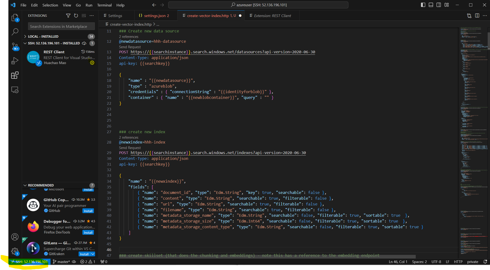
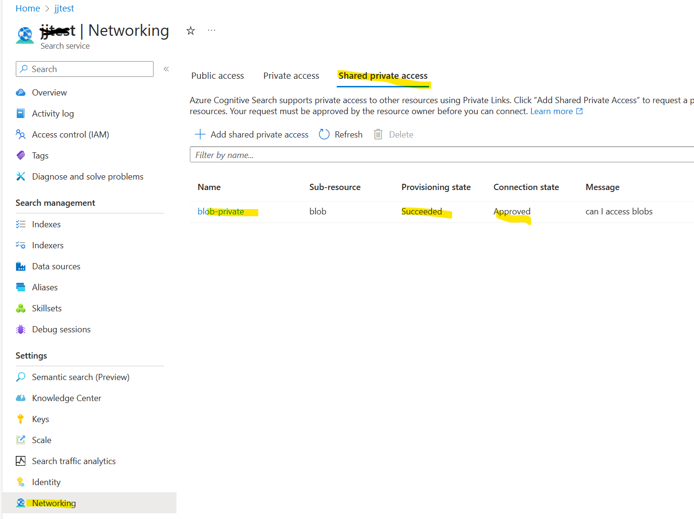
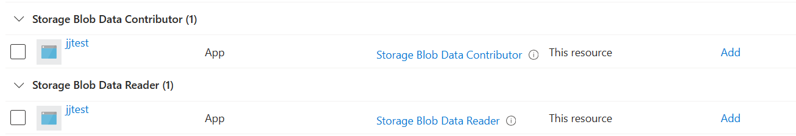

# Create Search indexes on non-public Search and Storage
It is often a security requirement that Azure Search be used in an application it has a private endpoint.

If Azure Search uses Azure blob storage as the data source for it's indexes, then it is also good practice to make the blob storage account network restricted so that it is only network visible inside an Azure virtual network.To enhance security more, managed identities are also prefered for access to the blob storage account.

The indexing process of Azure Search therefore needs to be amended to make it work with private endpoints and managed identities.

## Private endpoint concerns
There are a number of ways of building and populating Search indexes, and these often use API or REST calls. When the Search service has a private endpoint, then these scripts can no longer be executed from a remote computer or PC and so need to be executed in a VM whose network settings make the Search service network reachable. The simplest scenario is a VM in the same virtual network as the Search service (or more accurately, its private endpoint).

Ideally, this should be in customer managed GitHub Runner or DevOps build agent in the same virtual network.

For a more interactive approach, Visual Studio Code can be [configured](https://code.visualstudio.com/docs/remote/ssh-tutorial) to remotely connect to a virtual machine and then API or REST requests initiated from VS Code - but these will run inside the connected VM.



Above shows VS Code connected to a remote VM itself running the REST client showing how you can execute REST requests in the context of the virtual machine.

You can also configure environment variables to be injected in, so that secrets are not displayed or stored in the REST client HTTP files.

## Azure Resource Private Endpoints
The following need to be configured to have a private endpoint:
1. the Azure Search service itself
2. The blob storage account

In addition, the Azure Search service needs to set the Azure Storage account in its *shared private access*



## Dealing with Identity
Azure Search needs to be able to connect to and interact with blob storage for:
1. Pulling in documents in the form of PDFs etc. (read from blob)
2. Creating blobs in intermediate storage containers for chunking and vectorisation (write to blob)

For this to work:
1. Managed identity for Azure Search needs to be enabled
2. The storage account needs to allow Azure Search's managed identity to access blobs
3. Search data source needs to use a managed identity reference, rather than connection string (to read blobs)
4. Search Skillset similarly needs to use managed identity to the storage account (to write to a different blob container with chunks)

### Storage role assignments


In the above, 2 role assignments have been created for Azure Search access (strictly-speaking the managed identity associated with Azure Search) to Azure Storage. One for read and the other for write.

### Data Source
```
@newdatasource=hhh-datasource
POST https://{{searchinstance}}.search.windows.net/datasources?api-version=2020-06-30
Content-Type: application/json
api-key: {{searchkey}}

{
    "name" : "{{newdatasource}}",
    "type" : "azureblob",
    "credentials" : { "connectionString" : "{{identityforblob}}" },
    "container" : { "name" : "{{newblobcontainer}}", "query" : "" }
}
```
The above looks little different from the standard call, except that the connectionString setting refers to a managed identity:

```
ResourceId=/subscriptions/XXXXXXX-XXXX-XXXX-XXXX-XXXXXXX/resourceGroups/<resource-group>/providers/Microsoft.Storage/storageAccounts/<source-storage-account>;
```

### Skillset
Much the same story, for the skillset connection to the storage account
```
"cognitiveServices": null,
  "knowledgeStore": {
    "storageConnectionString": "{{identityforblob}}",
```
