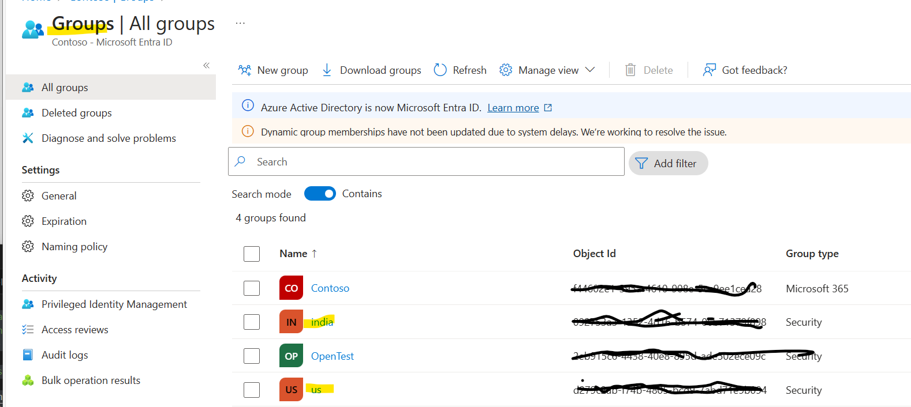

# Implementing Filtered Search with Embeddings
It is often necessary to restrict access to documents, so that when a user asks an Azure OpenAI chat application, they can only search documents that apply to them.

To automate this process, the logged on user needs to be tagged in such a way that this **filtering** process is automatic.

One way to do this is to associate the user with An Azure AD Group (Entra ID group) and this association only allows documents that "belong" to this group.

## How this works
1. The OpenAI with data use case provides an optional filter clause to allow a search to be done but filtered.
2. The search index needs to be built with this filter column and populated so that when the filter is applied, then only those document fagments associated with that filter get returned.
3. The logged on user's identity can be inspected by the application to list the AD group IDs to which they belong
4. These can then be added to the filter clause, so that correctly tagged documents will only be searched
5. One approach to this is to set custom meta data onto the documents in blob storage, so that the indexing process picks up this meta-data and then applies this to the indexes.
6. If the document is in Azure blob storage, a meta data tag **group_ids** can be added that contains an array of the AD group IDs that are allowed to view the indexes created from this.
7. This meta data is then picked in the indexing process and applied to the main index
8. The filter clause then uses the corresponding group_ids pulled in from the user's AD group membership to then automatically construct a filter onto the data.

## Setting up the indexes
See the [REST example](./filtered-index.http)

## Create AD Groups

## Add User membership to these groups

## Set blob meta data
See the guide on [document-level access control](https://learn.microsoft.com/en-us/azure/ai-services/openai/concepts/use-your-data#document-level-access-control) 

